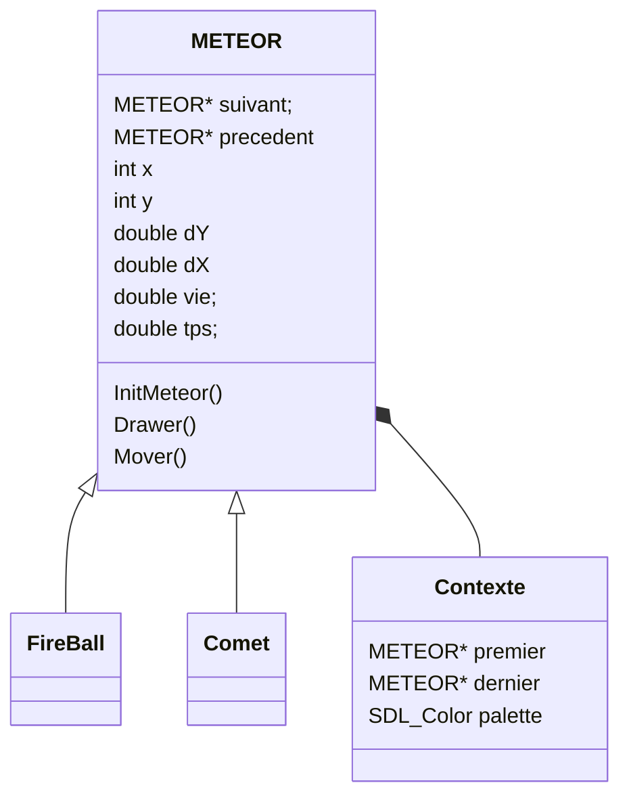

# Fireball
A fireball in different language based on my very old code (1998) first done in C on DOS.
Still in 256 colors in SDL2.

## Class Diagram




## C
Basiqualiy the same code that I've done in 1998.

### Compile on windows
Use the make file
```
mingw32-make.exe
```

