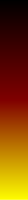
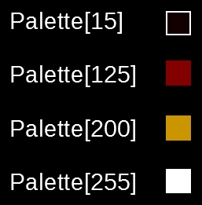
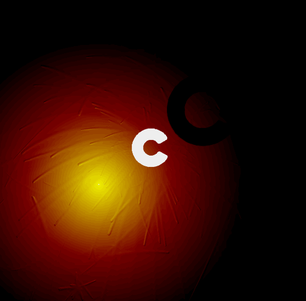

# Fireball
A fireball in different language based on my very old code (1998) first done in C on DOS.
Still in 256 colors in SDL2.

## Le mode de couleur
Pour permettre les différents effets de ce programme, il faut utiliser une palette de 256 couleurs en dégradé. Chaque couleur étant indexée de 0 à 255.

## Fireball mode
Ce mode est un système de particule avec un effet de flou pour donner cet effet de feu.

### Déplacement des particules
### Effet de flou

## Bump mode

## Shadow mode

