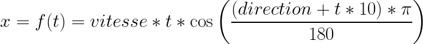
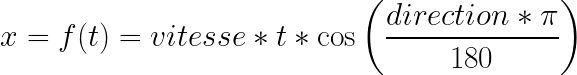
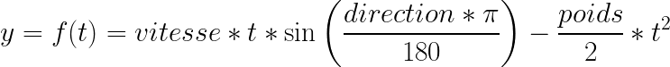

# Fireball
A fireball in different language based on my very old code (1998) first done in C on DOS.
Still in 256 colors in SDL2.

## Le mode de couleur
Pour permettre les différents effets de ce programme, il faut utiliser une palette de 256 couleurs en dégradé. Chaque couleur étant indexée de 0 à 255.

## Fireball mode
Ce mode est un système de particule avec un effet de flou pour donner cet effet de feu.

### Déplacement des particules
Les particules suivent une mouvement en fonction des éléments suivants:
* un point de départ (PARTICULE.x, PARTICULE.y), généralement le centre mais il peut en apparaître  là où une autre a explosé
* une direction (PARTICULE.dir), en degré de 0 à 360
* une vitesse (PARTICULE.vitesse), de 0 à 25
* un poid (PARTICULE.poids), à -5
Elles ont chacune une durée de vie (PARTICULE.tps) qui commence à 0 et s'incrément à chaque frame jusqu'à atteindre un maximum (PARTICULE.vie).

A ce moment là, la particule est réinitialisée, et si elle est épémère, alors elle disparaît complètement, dans le cas contraire, de nouvelles valeurs aléatoires lui sont attribuées. Si elle est explosive, alors de nouvelles particules sont émises depuis son point de destruction.

Il y a deux sortes de mouvement de particule.
* comète
Le mouvement est similaire à celui d'un astre tournant autour d'un autre astre.

La formule est la suivante:

* boule de feu, elle se déplace comme n'importe quel objet, avec une gravité. Elle est lancée, et elle retombe.

La formule est la suivante:

### Effet de flou

## Bump mode

## Shadow mode

## Glass mode

